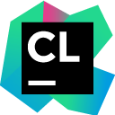
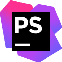
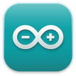
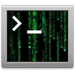

<!--suppress ALL -->
<h1 align="center">

</h1>

<h3 align="center">
I'm a developer with a passion for building and modifying applications, 
particularly within the Klipper (for 3D printing) and Android ecosystems. 
I specialize in custom development, including creating custom install applications.
</h3>

 

* I thrive on solving complex problems and am always eager to learn new technologies.
* To create efficient and innovative solutions.
* My journey in development is driven by a curiosity to understand how things work and a desire to make them better.
- - -
<h3 align="center">⚒️ Languages-Frameworks-Tools ⚒️</h3>
  

     

 

     

