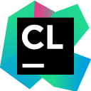
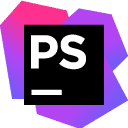
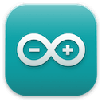

<!--suppress ALL -->
<h1 align="center">

</h1>
<h2 align="center">
Old by age, but young as a developer.
</h2>
<h3 align="center">
Welcome to my GitHub profile!  
Here you'll find my latest projects, collaborations, and a showcase of my coding journey.
A developer with a passion for building and modifying applications, 
particularly within the Klipper (for 3D printing) and Android ecosystems. 
I specialize in custom development, including creating custom install applications.
</h3>

 

* I thrive on solving complex problems and am always eager to learn new technologies.
* To create efficient and innovative solutions.
* My journey in development is driven by a curiosity to understand how things work and a desire to make them better.

<h3 align="center">
A little more than a beginner (or so I feel!)
</h3>
Recently I completely fell head over heels for CachyOS. Within one week of trying it, my **ScamDows** partition was completely wiped and CachyOS became my daily driver. That was 6 months ago, and I haven't regretted it for a single second! I am 100% Linux, no dual boot, no secondary, and again no regrets.

*   **The Catalyst:** I got into learning development entirely because of **Klipper** and **Marlin**.
*   **The Background:** I had always just been a PC guy who used his machine for gaming.
*   **The Realization:** When I dove into custom machines for 3D printing, I quickly learned I needed a few more skills than just pressing the "Play" button in Steam!

1. **Learning the Ropes:** I had to learn **VS Code** just to compile **Marlin**. It took me a long time—and yeah, I'm embarrassed to admit that—but it's the absolute truth.
2. **The Turning Point:** It wasn't long before I was introduced to **Klipper**, and I was instantly sold on the concept. But man, did it open my eyes to a much steeper learning curve than I ever expected. No more Auto Marlin Build, now I have to learn `.css` and `python`, `jinja2` and multiple other languages.

---

## Technical Skillset
A comprehensive breakdown of the languages and syntaxes I am actively using:

### Scripting & Automation
*   **Shell Scripting (Bash / POSIX):** Writing automation logic for network interface transitions, routing management, and service control.
*   **Fish (Friendly Interactive Shell):** Configuring custom terminal environments, aliases, and interactive command-line functions.

### Core Programming & Backend
*   **Python:** Powering Klipper host software, API integrations, and backend data processing.
*   **C:** Compiling and flashing optimized microcontroller firmware for hardware mainboards.

### Configuration, Templating & Logic
*   **Lua:** Scripting modern Wayland window manager environments, writing custom display rules, and managing desktop variables.
*   **Jinja2:** Developing dynamic, logic-heavy Klipper macros with variables and conditional statements.
*   **INI / CFG / CONF:** Structuring hardware definitions, system configurations, and secure network tunnel parameters.

### Frontend & Theming
*   **JavaScript / TypeScript (Vue.js):** Navigating and modifying reactive single-page applications like Mainsail.
*   **CSS:** Writing custom stylesheet overrides for UI theming and web interface personalization.

- - -
<h3 align="center">⚒️ Languages & Frameworks & Tools ⚒️</h3>
  

     

 

     

---

## Currently Listening

[Listen on Spotify](https://open.spotify.com/track/5reBgSnHk4HWWS49MHkKn1)

<iframe data-testid="embed-iframe" style="border-radius:12px" src="https://open.spotify.com/embed/track/5reBgSnHk4HWWS49MHkKn1?utm_source=generator&si=c0e6ab771f1f4d24" width="100%" height="352" frameBorder="0" allowfullscreen="" allow="autoplay; clipboard-write; encrypted-media; fullscreen; picture-in-picture" loading="lazy"></iframe>

